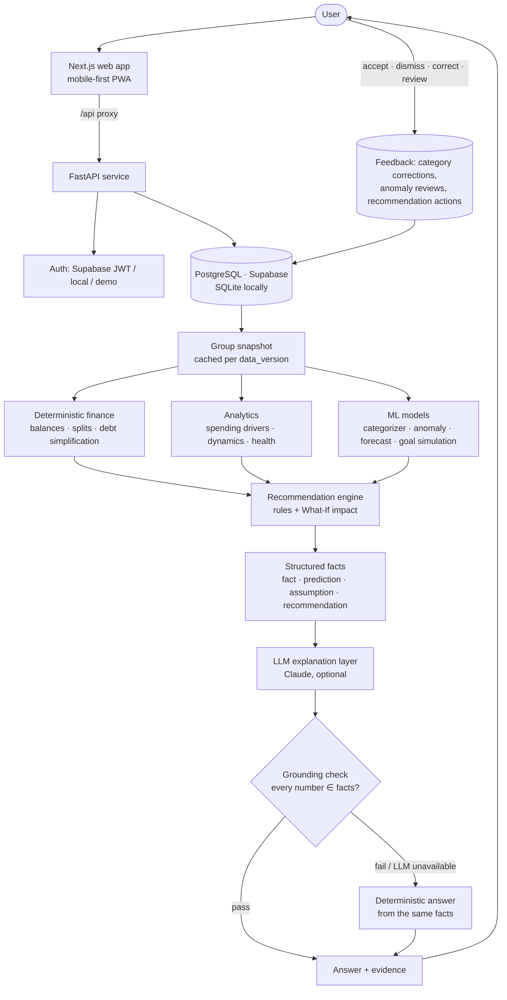

<div align="center">

# GroupWise AI
### Shared Financial Intelligence

**Split expenses. Understand spending. Predict what's next. Decide better together.**

Track 03 — Customer Innovation & Financial Independence · AI Hackathon prototype

</div>

> GroupWise AI doesn't just tell groups where their money went. It helps them understand what is happening, anticipate what comes next, and make better financial decisions together.

---

## 1. Project overview

GroupWise AI is a responsive web app (installable as a PWA) for people who manage money together: roommates, friend groups, travel groups and student clubs. Exact shared-expense management is the **foundation**. The **core innovation** is a layer of explainable financial intelligence on top of it:

| A conventional splitter asks | GroupWise also answers |
|---|---|
| “Who owes whom?” | Where is our money going? · Why did our spending change? · What is likely to happen next? · What looks unusual? · Can we reach our goal? · What should we change? · How is financial responsibility distributed in the group? |

Every AI feature follows the same chain, and the UI shows each link:

```
TRANSACTION DATA → FINANCIAL INTELLIGENCE → UNDERSTANDING → PREDICTION → RECOMMENDATION → ACTION (the user decides)
```

## 2. Problem statement

> For students and young adults who regularly share expenses, fragmented group spending makes it difficult to track shared financial responsibility, understand spending behaviour, predict upcoming financial pressure, and make better financial decisions.

## 3. Target users

The first version is designed specifically for **university students and young adults in Bangladesh who share costs**: roommates, classmates who eat and travel together, trip groups and event or club groups. Examples include the Bangladesh weekend (Friday–Saturday, with Thursday night as the start), Banglish expense descriptions (“basha bhara”, “biddut bill”, “nasta”), local merchants and amounts in taka (৳).

## 4. Why this problem matters

- Shared money causes friction: one person quietly covers most upfront costs, reimbursements drag on, and nobody sees the pattern.
- Groups rarely see pressure coming. Weekend outings, month-start spikes and rent week arrive as surprises.
- Shared goals such as a trip fund often fail silently, with no early signal that the pace is too slow.
- Data-entry mistakes (a ৳16,500 that should have been ৳1,650) flow straight into everyone's balances.

## 5. Solution

GroupWise combines a **deterministic, exact ledger** with **purpose-built ML and analytics**, and uses an **LLM only to explain computed facts**:

1. Record expenses naturally: “Lunch at Kacchi Bhai 850” is parsed and categorized.
2. Balances and the minimum settle-up plan are computed exactly, to the paisa.
3. Analytics and ML explain what changed and why, flag unusual expenses, forecast the coming days, and project goals.
4. A recommendation engine proposes actions and **simulates their outcome** with the What-If engine.
5. *Ask GroupWise* answers questions in plain English, citing the facts it used, with every number verified against the data.
6. **People decide.** Nothing is blocked, nothing is automatic.

## 6. Features

| Area | What it does | Type |
|---|---|---|
| Accounts & groups | Sign up/in (Supabase Auth or built-in), groups, invite links, join (and claim a placeholder member), leave when settled, settings | App |
| Expenses | Natural-language entry, payer, participants, equal split (percentage & exact implemented in the engine), date/time, payment method, edit/delete | App |
| **Balance engine** | Paid, share, settlements, net (“Gets ৳X” / “Owes ৳X” with icon + text) | **Deterministic — not AI** |
| **Debt simplification** | Greedy minimum cash-flow; ≤ n−1 payments (“4 payments instead of 10”) | **Deterministic — not AI** |
| AI 1 · Smart categorization | Category › subcategory › type, confidence, alternatives, the words that drove it, “please confirm” when unsure; corrections remembered per group | ML classifier |
| AI 2 · Spending intelligence | Period comparison, driver decomposition (“weekend restaurant spending accounts for 61% of the increase, mostly bigger bills”), weekday pattern, merchants, members | Statistical pattern detection |
| AI 3 · Unusual expense detection | Score + reasons (“8.2× the usual upper range for Restaurant…”), review: mark valid / dismiss / edit; never blocks | Isolation Forest + robust stats + rules |
| AI 4 · Cash-flow forecast | Next 7/14/30 days with an 80% range, pressure days, drivers, recurring bills, per-member expected share, backtest accuracy | Time-series model |
| AI 5 · Goal planner | Saved, projected, gap, required pace, simulated likelihood, scenarios that close the gap | Projection + Monte-Carlo |
| AI 6 · Group dynamics | Paid vs consumed shares, high-value payer share, reimbursement delays, contribution balance index, payer rotation suggestion | Behavioural analytics (observable payments only) |
| **What If?** | Sliders per category, overall change, extra contributions → savings, pressure, per-member burden, goal impact | Simulation on the forecast |
| **Ask GroupWise** | Grounded copilot with evidence chips, typed facts, numeric verification, graceful fallback | LLM explanation layer |
| Financial health | Transparent weighted score with “How is this calculated?”, labelled *prototype indicator* | Formula |
| Notifications, PWA | Unusual expenses, goal/forecast alerts, activity; installable, offline page, never caches financial data | App |

## 7. AI/ML architecture



**Never** `database → free-form LLM → made-up financial answer`. The LLM receives typed facts with ids and must cite them. A grounding check extracts every number from its answer and matches it against the facts. If any number fails to match, the LLM text is discarded and the deterministic answer is shown.

### Deterministic vs ML vs LLM

| Deterministic business logic | ML / statistical models | LLM components |
|---|---|---|
| Money in integer paisa; equal/percentage/exact splits that always sum exactly | Expense categorizer (TF-IDF + logistic regression) | *Ask GroupWise* wording only |
| Balance sheet with a conservation invariant | Anomaly detector (Isolation Forest + robust z-scores + rules) | Never calculates, never decides |
| Debt simplification (≤ n−1 transfers) | Cash-flow forecast (seasonal smoothing + recurring bills) | Output verified number-by-number |
| Spending period comparison & driver decomposition | Goal likelihood (bootstrap Monte-Carlo) | Optional: everything works without it |
| What-If arithmetic, health formula | Intent detection for the copilot (rules + classifier) | |

## 8. AI models & methods

| Model | Method | Why this choice | Explainability |
|---|---|---|---|
| **Categorizer** `tfidf-logreg-1.1` | Word (1–2) + char (2–5) n-gram TF-IDF → multinomial logistic regression over 34 subcategories; known-merchant prior; per-group memory of corrections | Short, noisy, often Banglish text; char n-grams handle typos/transliteration; calibrated-enough probabilities drive a confirm-when-unsure UX; trains in < 1 s | Confidence, top-3 alternatives, contributing words |
| **Anomaly detector** `iforest-robust-1.2` | Noisy-OR of: robust z vs subcategory (leave-one-out), robust z vs group, Isolation Forest rank (amount, peer z, rarity, time, weekday, party size), night-time, rare category, duplicate | Each signal maps to a human reason; robust statistics resist outliers; Isolation Forest adds multivariate context | Score + reasons with evidence (ratio to typical range, percentile, time share) |
| **Forecast** `seasonal-ets-1.0` | Calendar-based recurring-bill detection + per-category exponential smoothing (half-life 14 d) with shrunk weekday & month-phase factors; one-offs excluded | Small per-group data; interpretable components; beats naive baselines | Drivers (heaviest days, trends, upcoming bills), 80% range from the group's own rolling backtest |
| **Goal likelihood** | Linear projection + 4,000-path bootstrap of the group's weekly contributions | Honest uncertainty with no distributional assumptions | Shown as “simulated likelihood”, never a guarantee |
| **Copilot** | Rules + TF-IDF/LR intent detection → fact builders → Claude (`claude-opus-5-5`, low effort, server-side refusal fallback) → grounding check | Grounded generation; robust to prompt injection | Inline `[F#]` citations, evidence panel, “N/N figures verified” badge |

### Evaluation (synthetic-data simulation — see [docs/MODEL_EVALUATION.md](docs/MODEL_EVALUATION.md))

| Model | Test set | Result |
|---|---|---|
| Categorizer | 245 examples from **merchants and phrasings never seen in training** | Category accuracy **83.3%**, subcategory accuracy **80.4%** (macro F1 79.7%); **97.8%** accuracy on the 73% of cases where the model is confident, and the rest ask the user to confirm |
| Anomaly detector | 40 unseen groups, 13,690 transactions, 231 labelled anomalies (tuned on separate validation seeds) | Precision **88.7%**, recall **95.2%**, F1 **91.9%**, false-positive rate **0.21%** |
| Forecast (7-day total) | Rolling-origin backtest, 20 test groups, 160 windows | MAE **৳2,902** vs ৳7,673 for a 28-day-average baseline (**62% lower**); RMSE ৳3,528 vs ৳9,235 |

Regenerate with `python -m scripts.evaluate_models` (writes `backend/app/ml/evaluation.json`, served on the *How the AI works* page).

## 9. Technology stack

| Layer | Technology |
|---|---|
| Frontend | Next.js 16 (App Router), React 19, TypeScript, Tailwind CSS v4, shadcn/ui on Base UI, TanStack Query, Recharts, lucide icons |
| Backend | Python 3.12+, FastAPI, SQLAlchemy 2, Pydantic v2 |
| Data / ML | NumPy, scikit-learn (Pandas for evaluation reports) |
| LLM | Anthropic Claude via the official Python SDK (optional) |
| Database / Auth | Supabase PostgreSQL + Supabase Auth (JWKS/HS256 verification); SQLite + built-in auth for local dev |
| Deployment | Vercel (web), Render or any Docker host (API), Supabase (DB/Auth) |
| Quality | pytest (21 tests), ruff, ESLint, `tsc`, GitHub Actions CI |

## 10. Synthetic data strategy

No real customer data is used anywhere. Groups are **simulated from explicit behaviour**, not random noise. Full details are in [docs/SYNTHETIC_DATA.md](docs/SYNTHETIC_DATA.md).

- **Normal patterns:** weekday lunches, snacks after class, evening rides, groceries, recurring rent and utilities, with log-normal amounts in realistic taka ranges.
- **Time patterns:** Thursday-night and Friday/Saturday dinners (Bangladesh weekend), month-start "allowance" effect, late-night deliveries.
- **Trends:** weekend restaurant spending rising over the last 30 days.
- **Group behaviour:** one member fronts ~45% of costs; members settle on different cadences (1–2 days vs 7–11 days), producing real reimbursement delays.
- **Anomalies (labelled):** amount spikes, a 3 AM delivery, a duplicate entry, a rare-category purchase, an electricity bill 3.4× normal.
- **Goals:** a trip fund that is behind and an emergency fund that is on track.
- Demo groups use low-variance sampling so the story holds on any day (verified by `scripts/check_demo_robustness.py`). **Evaluation uses separate seeds with full Poisson noise**, with validation and test seeds kept apart.
- Every demo visitor gets a **private, expiring sandbox** (48 h) seeded through the same ML models as live data.

## 11. Responsible AI

- **Privacy:** synthetic data only. Service-role keys are never used by the client. The API is the only data path, and RLS is enabled on every table so the public anon key can't read data.
- **Explainability:** every insight shows observation → inference → evidence → method → confidence.
- **Transparency:** UI badges distinguish *Observed fact*, *Model prediction*, *Assumption*, *AI explanation*, *Recommendation* and *Exact calculation*.
- **Human oversight:** unusual expenses are flagged for review and never blocked. Recommendations can be marked helpful or dismissed, and dismissed ones are hidden for 7 days. Category corrections are respected and remembered.
- **No judgments:** group dynamics analyse observable payments only, never personality, intent, reliability or financial status. Wording is neutral.
- **Honest uncertainty:** “projected”, “estimated”, “simulated likelihood” (shown as “<1%” or “>99%” rather than 0% or 100%), 80% ranges, and a *prototype* health indicator.
- **AI security:** explicit handling of prompt-injection attempts and out-of-scope advice (investment, loans, tax). Expense text is sanitized and fenced as data. The numeric grounding check catches invented numbers. Rate limits apply to auth, demo and copilot. The LLM has no tools and no write access.
- **Fallbacks:** if the LLM is down, auth, groups, expenses, balances, analytics and all ML features keep working, and the copilot answers deterministically with a notice.

## 12. Architecture

```
groupwise-ai/
├── backend/                 FastAPI service
│   ├── app/core/            deterministic finance: money, splits, balances, debt simplification
│   ├── app/ml/              categorizer, anomaly detector, forecast, taxonomy, text parsing
│   ├── app/analytics/       spending, dynamics, goals, What-If, health, insights & recommendations
│   ├── app/copilot/         intent detection + fact builders + grounded answer engine
│   ├── app/llm/             Claude client (fallback-safe) + grounding check
│   ├── app/synthetic/       behaviour-driven generator, scenarios, seeding
│   ├── app/services/        snapshot cache, expense lifecycle, notifications
│   ├── app/api/             routers (auth, groups, expenses, intelligence, notifications, meta)
│   ├── scripts/             evaluate_models, check_demo_robustness, export_schema
│   └── tests/               21 tests (finance invariants, API flows, ML, grounding)
├── frontend/                Next.js web app (mobile-first, PWA)
│   └── src/app/             landing, auth, /groups, /g/[groupId]/{dashboard, add, transactions,
│                            balances, insights, forecast, goals, what-if, ask, dynamics, members},
│                            notifications, profile, join, how-it-works, offline
├── supabase/schema.sql      generated DDL + row-level security
├── docs/                    architecture, synthetic data, model evaluation, demo script, deployment
└── render.yaml              API deployment blueprint
```

More detail is in [docs/ARCHITECTURE.md](docs/ARCHITECTURE.md).

## 13. Installation

Prerequisites: **Python 3.12+**, **Node.js 20+**.

```bash
git clone <your-repo-url> groupwise-ai && cd groupwise-ai

# Backend
cd backend
python -m venv .venv
.venv/Scripts/activate        # Windows (macOS/Linux: source .venv/bin/activate)
pip install -r requirements-dev.txt
cp .env.example .env          # defaults work out of the box (SQLite, demo sandbox, no LLM)

# Frontend
cd ../frontend
npm install
cp .env.example .env.local    # BACKEND_URL=http://127.0.0.1:8000
```

## 14. Environment variables

**Backend (`backend/.env`):**

| Variable | Purpose | Default |
|---|---|---|
| `DATABASE_URL` | SQLite locally or the Supabase pooled Postgres URL | `sqlite:///./groupwise.db` |
| `JWT_SECRET` | Signs locally issued tokens (required in production) | dev value |
| `SUPABASE_URL` / `SUPABASE_JWT_SECRET` | Accept Supabase Auth tokens (JWKS, or legacy HS256 secret) | empty |
| `ALLOW_LOCAL_AUTH` | Built-in email/password accounts | `true` |
| `DEMO_ENABLED` / `DEMO_TTL_HOURS` | One-click private demo sandbox | `true` / `48` |
| `ANTHROPIC_API_KEY` | Enables natural-language copilot answers | empty (deterministic answers) |
| `LLM_MODEL` / `LLM_EFFORT` | Claude model and effort | `claude-opus-5-5` / `low` |
| `CORS_ORIGINS`, `PUBLIC_APP_URL` | Web origin and invite-link base URL | `http://localhost:3000` |

**Frontend (`frontend/.env.local`):** `BACKEND_URL`, plus optional `NEXT_PUBLIC_SUPABASE_URL` and `NEXT_PUBLIC_SUPABASE_PUBLISHABLE_KEY` (public publishable key only; legacy `NEXT_PUBLIC_SUPABASE_ANON_KEY` also works).

## 15. Run commands

```bash
# Terminal 1 — API on http://127.0.0.1:8000 (docs at /api/docs)
cd backend && uvicorn app.main:app --reload --port 8000

# Terminal 2 — web app on http://localhost:3000
cd frontend && npm run dev
```

Open http://localhost:3000 and click **Explore the live demo**.

## 16. Testing

```bash
cd backend
pytest                                   # 21 tests: finance invariants, randomized debt simplification,
                                         # end-to-end API flows, ML behaviour, grounding check, intents
ruff check app scripts tests
python -m scripts.evaluate_models        # model metrics on held-out synthetic data
python -m scripts.check_demo_robustness  # demo narrative across 28 different "today" dates

cd ../frontend
npm run lint && npx tsc --noEmit && npm run build
```

CI runs all of the above on every push (`.github/workflows/ci.yml`).

## 17. Live URL

> **Live demo:** _add the deployed URL here after deployment._ See [docs/DEPLOYMENT.md](docs/DEPLOYMENT.md) (Supabase → Render → Vercel, about 20 minutes).

## 18. Demo instructions

1. Open the app and click **Explore the live demo**. You get a private sandbox with three synthetic groups.
2. Follow the 90-second script in [docs/DEMO_SCRIPT.md](docs/DEMO_SCRIPT.md):
   dashboard → add *“Dinner at Kacchi Bhai 16500”* (AI categorization + unusual-expense dialog) → Insights (*why* food spending rose) → Forecast → Goal planner → **What-If** (cut dining 15%) → **Ask GroupWise** (“Why did our spending increase?”) → evidence chips → recommended action → simulated outcome.
3. The *How the AI works* page shows model cards and evaluation metrics.

## 19. Known limitations

- All models are validated on **synthetic data only**. Real-world performance needs validation on governed, anonymized data.
- The forecast cannot anticipate genuine one-off events. For small or irregular groups the range is wide, and the app shows it.
- The categorizer covers 34 Bangladesh-flavoured subcategories. Unfamiliar merchants rely on context words, and the app asks for confirmation when unsure.
- The demo sandbox is per-visitor and expires after 48 h. On free hosting the API may take up to a minute to wake.
- No real payments move: settlements are recorded, not executed. Percentage and exact splits exist in the engine and API but the MVP UI uses equal splits.
- Built-in rate limiting is in-memory (per instance).

## 20. Future integration path

```
Synthetic data  →  Prototype validation with student groups  →  Controlled validation on governed,
anonymised or aggregated data  →  Potential integration with an MFS backend
```

Potential MFS value: deeper everyday utility for shared money, engagement around goals, personalised but explainable insights, and new financial-intelligence products, delivered with the same rule that **AI recommends and people decide**.

---

<sub>GroupWise AI is an independent hackathon prototype. It is not affiliated with or endorsed by upay or any financial institution, it uses an upay-*inspired* colour direction only, it uses synthetic data, and it makes no claims about business results. Not financial advice.</sub>
