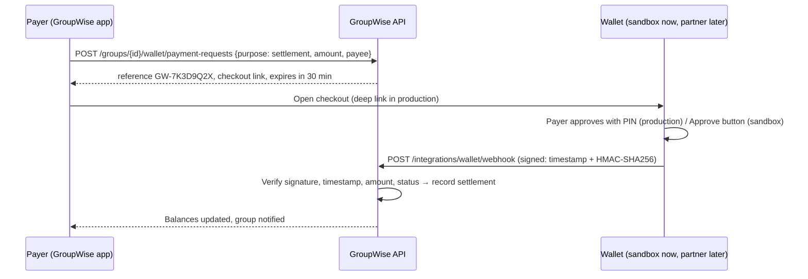
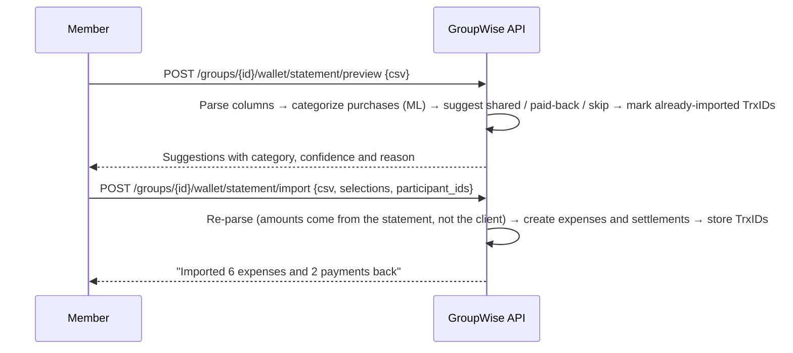

# Mobile wallet (MFS) integration

GroupWise is designed to live **inside a mobile wallet** such as a future upay integration (a possible path,
not an official partnership). The prototype already implements the three touch points end to end. Only the
wallet's own approval screen is simulated.

| Touch point | Direction | What it does | In the prototype |
|---|---|---|---|
| **1. Statement import** | wallet → GroupWise | Turns wallet transactions into shared expenses and payments back. The AI categorizes each one and suggests shared or personal. | Built: CSV import with flexible columns, ML categorization, TrxID de-duplication |
| **2. Pay or request through the wallet** | GroupWise → wallet → GroupWise | Settle-up payments run on the wallet's existing *Send Money* or *Request Money* rails and are recorded only after a signed confirmation. | Built: payment requests, signed webhook, sandbox checkout |
| **3. Group goal pocket** | GroupWise → wallet | Members put money aside for the shared goal from their wallet. The goal planner tracks it. | Built as "Save via wallet". In production it would be a dedicated goal wallet, like upay's multi-wallet. |

## What is real and what is simulated

| Part | Prototype | With a wallet partner |
|---|---|---|
| Statement parsing | **Real.** Reads CSV exports with different column names (TrxID, Transaction ID, Debit/Credit…), skips cash-out, top-ups and money received | Same parser, or the partner's read-only transaction API with the customer's consent |
| Categorization and suggestions | **Real.** The expense model categorizes each purchase. Rules suggest shared or personal and spot paying a group member back | Same |
| Payment requests | **Real.** Reference (`GW-XXXXXXXX`), amount, payer and payee, 30-minute expiry, status `pending → paid / cancelled / failed / expired` | Same |
| Customer approval | **Simulated.** Sandbox checkout page | Customer approves in the wallet app with their PIN |
| Confirmation | **Real.** HMAC-SHA256 signed webhook with timestamp, amount and currency checks; idempotent | Same endpoint, signed with the partner's shared secret |
| Money movement | **None.** No real money moves | The partner's existing Send Money / Request Money rails |

GroupWise never sees PINs, passwords or wallet balances, and never holds money.

## Flows

### Settle up through the wallet



A **money request** works the same way, except that the person who is owed creates it and the other member
approves it in their own wallet, like bKash's *Request Money*. In the sandbox, if that member isn't on the app,
the requester can simulate their approval. This is clearly labeled.

### Import a wallet statement



## API contract

| Method and path | Body | Notes |
|---|---|---|
| `GET /api/groups/{id}/wallet/sample-statement` | — | Synthetic sample statement for demos |
| `POST /api/groups/{id}/wallet/statement/preview` | `{csv}` | Up to 500 rows / 200 KB; nothing is stored |
| `POST /api/groups/{id}/wallet/statement/import` | `{csv, selections: [{txn_id, action: expense \| settlement, to_member_id?, subcategory?}], participant_ids}` | Up to 200 transactions per import; duplicates skipped |
| `POST /api/groups/{id}/wallet/payment-requests` | `{purpose: settlement \| goal_contribution, amount, payee_member_id? , goal_id?, payer_member_id?}` | `payer_member_id` creates a request; it must be for money owed to the requester |
| `GET /api/wallet/payment-requests/{id}` | — | Group members only |
| `POST /api/wallet/payment-requests/{id}/sandbox` | `{action: approve \| decline}` | Sandbox only; signs the same event a real wallet would send |
| `POST /api/integrations/wallet/webhook` | signed event (below) | Called by the wallet provider |

**Signed event**

```http
POST /api/integrations/wallet/webhook
X-GroupWise-Timestamp: 1791345600
X-GroupWise-Signature: sha256=<hex HMAC-SHA256 of "1791345600.<raw body>" with WALLET_WEBHOOK_SECRET>
Content-Type: application/json

{"event": "payment.succeeded", "reference": "GW-7K3D9Q2X", "provider_txn_id": "BX7K2M9Q1A",
 "amount_paisa": 117103, "currency": "BDT"}
```

| Response | Meaning |
|---|---|
| `200 {"status": "paid"}` | Recorded. A repeated delivery of the same event also returns 200 and changes nothing |
| `401` | Bad signature, or timestamp older than 5 minutes (replay protection) |
| `404` | Unknown reference |
| `409` | Amount or currency mismatch, request expired, or already completed with a different transaction |

Events: `payment.succeeded`, `payment.failed`, `payment.cancelled`.

## Configuration

| Variable | Default | Purpose |
|---|---|---|
| `WALLET_SANDBOX_ENABLED` | `true` | Enables payment requests and the sandbox checkout |
| `WALLET_WEBHOOK_SECRET` | empty | Shared HMAC key for the public webhook (the webhook returns 503 until it is set) |
| `WALLET_REQUEST_TTL_MINUTES` | `30` | Payment request expiry |

## Path to a real integration (potential, not an official plan)

1. Partner sandbox access: payment or request-money API, webhooks, and a read-only transaction API.
2. Write a provider adapter with the same interface as `SandboxWallet` (`backend/app/integrations/wallet.py`), and set `WALLET_WEBHOOK_SECRET`.
3. Add a consent screen for read-only transaction access, replacing the CSV upload.
4. Security review, then a pilot with governed, anonymized data. See [PROBLEM_EVIDENCE.md](PROBLEM_EVIDENCE.md) and `research/`.
